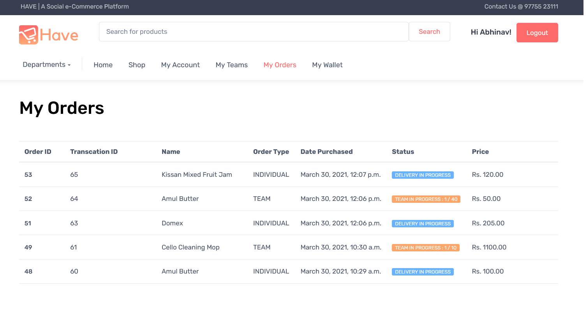

# HAVE Hybrid Automated Virtual Enterprise
A Social eCommerce Platform to facilitate Team purchase of E-Commerce Products.

<p><br></p><br>

## Motivation
Across the globe, as the novel coronavirus moves us from communal spaces into the confinement of our homes, our social experiences are forced to adapt. Beyond the social networks we already know and use, we find new ways to integrate socially into our online lives. We are considering what this might mean for the future of e-commerce. But now, as the world is recovering from the impact of COVID-19, a social-shopping approach is even better poised to capture the offline-to-online transition in commerce fully.

We found room in e-commerce, not as a competitor to search-based websites like Amazon, Flipkart,  but as a new e-commerce platform focused on interactive and social shopping experiences online.
Social shopping may seem like a new concept. Still, the reality is that in the physical world, shopping is meant to be “interactive and fun”, and purchases are regularly informed by friends and family.

Consider how much harder it feels to purchase a new clothing item without immediate feedback from friends. E-commerce platforms like Flipkart, Myntra, and Amazon don’t account for this. Instead, they optimise for efficiency, funnel conversion, and purchase rates. “Have”, on the other hand, will try to mimic the offline shopping experience online by building community via our team purchase model, driving engagement via fun rewards, and offering personalised experiences and value via recommendations.

Like something? Have it!

## Screenshots

<p></p>
<p></p><br>
<p></p><br>
<p></p><br>
<p></p><br>
<p></p><br>
<p></p><br>

## Getting Started

Download or clone this repository on your system. See deployment for notes on how to deploy 
the project on a live system.

### Prerequisites
```
- PYTHON 3.8.1
- DJANGO 3.1.7
```
### Installing
- Install python3 on your system
- Add python to environment variables
- Navigate to 'Codes' folder in terminal 
- Create an evironment using the following command -> virtualenv HAVE_env
- Activate the evironment using the following command  
```
     .\HAVE_env\Scripts\activate   (For Windows)
      source HAVE_env\bin\activate  (For Ubuntu)
```
- Run command ```pip3 install -r requirements.txt```
- Run command ```python3 manage.py makemigrations```
- Run command ```python3 manage.py migrate```
- Run command ```python3 manage.py runserver```
- Click on localhost link generated after execution of previous command

## Built With

* [Django](https://www.djangoproject.com/) 
* [MySQL](https://dev.mysql.com/doc/) 

## Contributing

Pull requests are welcome. For major changes, please open an issue first to discuss what you would like to change.
